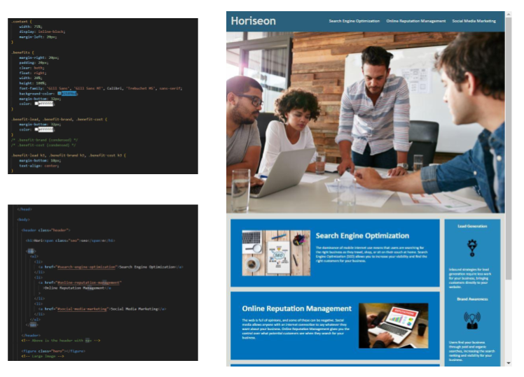

# Code-Refactor-ZK: HTML, CSS, Refactor Assignment - 20210520


## Overview
Tasked to "improve the codebase for long-term sustainability. Check that all links are functioning correctly. Also increase the efficiency of the CSS by consolidating the selectors and properties, organizing them to follow the semantic structure of the HTML elements, and including comments before each element or section of the page." and that codebase follows accessibility standards.


## Given Criteria
* Webpage meets accessibility standards.
* Source code has semantic HTML elements.
* Structure of the HTML elements follow a logical structure.
* Image elements have alt attributes.
* The title element is concise, descriptive.


## Design


Following the criteria above I altered the code in both the HTML and CSS while maintaining what functionality there was. 
I also made changes so the webpage would look similar to the provided reference image below.


## Links
[REPOSITORY](https://github.com/ZacharyWK/Code-Refactor-ZK)
```
https://github.com/ZacharyWK/Code-Refactor-ZK
```

[DEPLOYED](https://zacharywk.github.io/Code-Refactor-ZK)
```
https://zacharywk.github.io/Code-Refactor-ZK/
```
